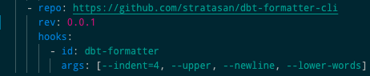

# dbt Formatter CLI

## CLI for using dbt-formatter in pre-commit

### Why?

As we began writing (and reading!) more dbt code, we struggled with the problem of ensuring our models, macros, and snapshots were being written in a consistent way. One solution we found was[this dbt-formatter extension for vscode](https://marketplace.visualstudio.com/items?itemName=henriblancke.vscode-dbt-formatter&utm_source=VSCode.pro&utm_campaign=AhmadAwais). However, this was difficult to implement team-wide, as not everyone uses vscode and the autosave feature disables the autoformatting of files. Therefore, we decided to make a command line interface for the [dbt-formatter package](https://github.com/henriblancke/dbt-formatter). We've also added a Dockerfile and pre-commit-hooks.yaml for use with [pre-commit](https://pre-commit.com/).

### Hot dog! So how do I use it?

**As a CLI**

1. Clone this repo
2. From root, run `npm install` to install dependencies, then `npm link` to connect cli
3. Format a file with `dbt-formatter <path/to/file.sql> <options>`

**As a pre-commit hook**

1. Add this repo to your .pre-commit-config.yaml with the current version and `dbt-formatter` for id. _Example below_
   

### Neat-o! Now, let's hear about the args.

**Required Arguments**
-- file path

**Optional Arguments**
_these are the same as found [here](https://github.com/henriblancke/dbt-formatter), except allow-camel-case has been changed to forbid-camel-case as the original has a default value of 'true'. We have changed this to aid in readability and consistency_
"--sql": String _default is 'default'_
"--indent": Number _default is 2_
"--upper": Boolean _default is false_
"--newline": Boolean _default is false_
"--lower-words": Boolean _default is false_
"--forbid-camel-case": Boolean _default is false_
"--check": Boolean _default is false_
